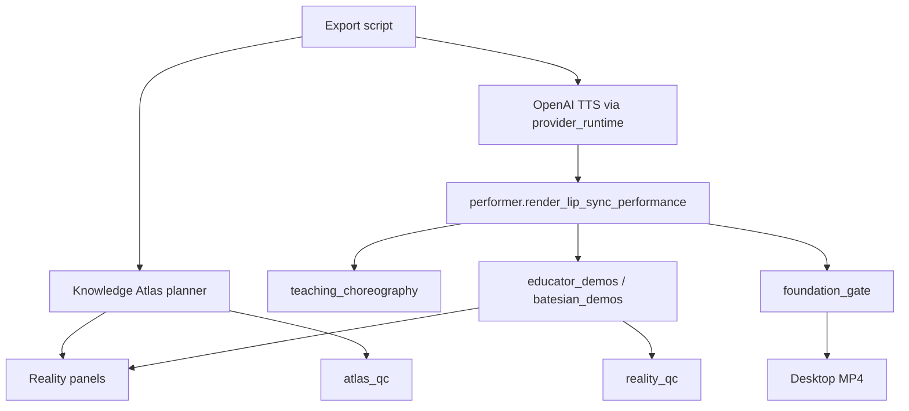

# Dependency Map — Integration & Release View

**Owner:** Agent 28  
**Canonical reference:** [`SYSTEM_DEPENDENCY_MAP.md`](SYSTEM_DEPENDENCY_MAP.md) (v9.7)  
**Updated:** 2026-07-12

This document extends the system dependency map with **Integration & Release** cross-cutting paths.

---

## Layer stack (unchanged)

```
UI (Streamlit) → Orchestrator → Engines → Services → Providers → Shared lib
```

Foundation Shorts **bypass** the full 23-stage orchestrator — they use the **direct performer path**:

```
Export script → communicator_delivery → performer → educator_demos → reality/knowledge_atlas panels → FFmpeg
```

---

## Foundation production dependency graph



---

## New integrations (2026-07-12)

| From | To | Contract |
|------|-----|----------|
| `biology_batesian_mimicry_series.py` | `knowledge_atlas.planner` | `plan_visual_evidence()` |
| `biology_batesian_mimicry_series.py` | `knowledge_atlas.feedback` | `record_lesson_visuals()` |
| `batesian_demos.py` | `reality.panel` | `draw_panels()` |
| `visual/sources.py` | `knowledge_atlas` | `atlas_image` adapter |
| `integration_release` | `readiness.report` | dashboard aggregation |
| Agent 28 | Agent 27 | standards + experiment registry |
| Agent 28 | Agent 0 | executive dashboard |

---

## External runtime dependencies

| Dependency | Required for | Local? |
|------------|--------------|--------|
| FFmpeg | All MP4 export | ✅ Local |
| OpenAI API | TTS (production voice) | Optional (`--smoke`) |
| Pillow | Animation frames, Reality panels | ✅ Local |
| Streamlit | Studio UI | ✅ Local |
| YouTube OAuth | Live publish/analytics | Cloud/operator config |

---

## Forbidden dependencies (architecture)

- Engine → engine direct imports (orchestrator only)
- Unregistered engines in stage groups
- Unlicensed images in Reality/Atlas catalogs
- Cloud-only render path for Foundation Shorts

---

## Validation commands

```bash
python3 -m pytest tests/test_architecture.py -q
python3 -c "from services.integration_release.audit import audit_subsystems; print(len(audit_subsystems()))"
```
