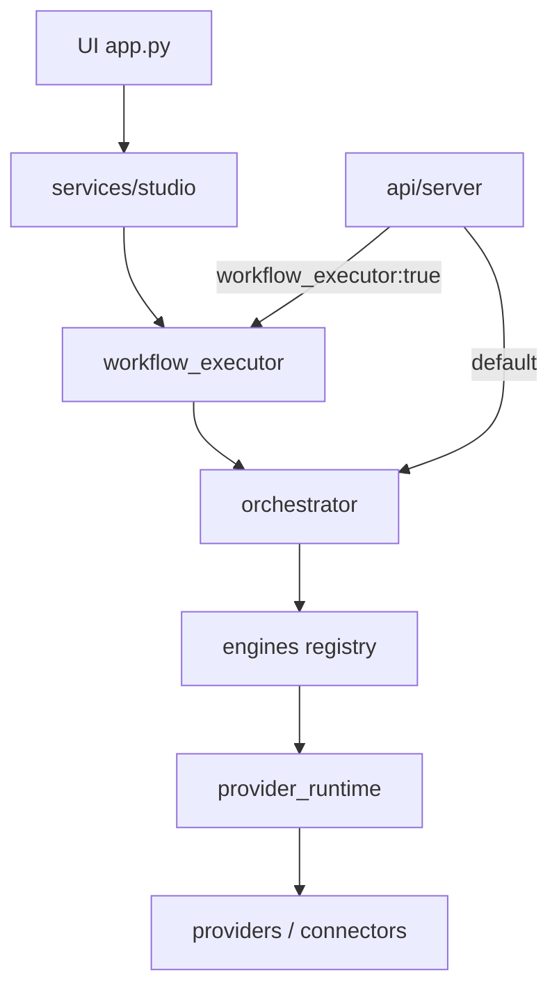

# Generational Version 1.0 — Release Candidate 1 (RC1)

**Version:** `1.0.0-rc1`  
**Branch:** `release/1.0.0-rc1`  
**Auditor:** Agent 1 — Chief Systems Architect / Release Manager  
**Date:** 2026-07-09  
**Evidence basis:** Discovery audit, architecture tests, full pytest suite, dry-run E2E pipeline, persistence round-trip, WE pause/cancel smoke, ProviderRuntime health inventory.

---

## Executive Summary

Generational is **feature-complete for a Demo/Dry-run Release Candidate**. The canonical path Studio → Workflow Executor → Orchestrator → Engines → ProviderRuntime works end-to-end through publish → analytics → learning. Project persistence now retains packages, publishing, and analytics artifacts. Publishing and Analytics tabs bind to real stores.

**Honest overall readiness: 91 / 100** (aggregator, learning armed, no live API keys).

**Go / No-Go:** **GO for controlled RC1 / private beta (demo + dry-run).**  
**NO-GO for public GA** until operator credentials, live publish smoke, and stub engine ownership are resolved.

---

## Architecture Report

### Dependency graph

### Validation results

| Check | Result |
|---|---|
| Engine registration (44 keys) | PASS |
| FutureEngine stubs (animation, character_universe, optimization_lab, brand_management) | WARNING-skip (by design) |
| Engines import `core.ai` / vendor SDKs | **0** (PASS) |
| Orchestrator closed loop analytics/learning | PASS |
| Studio → WE → Orchestrator | PASS |
| Internal HTTP API | PASS |
| Dual long-form controllers (WE + RuntimeExecutionEngine) | Accepted dual path; Studio uses WE |

Full detail: [SYSTEM_DEPENDENCY_MAP.md](SYSTEM_DEPENDENCY_MAP.md), [MASTER_ARCHITECTURE.md](MASTER_ARCHITECTURE.md).

---

## Production Readiness Report

See [PRODUCTION_READINESS.md](PRODUCTION_READINESS.md) (RC1 recalibrated scores).

| Area | Score | Evidence |
|---|---|---|
| Architecture | 94 | Registry + contracts + architecture tests |
| Execution | 92 | 23-stage dry-run E2E ~2.8s; stub WARNINGs |
| Provider Runtime | 88 | 36 connectors; **0 keys** in this environment |
| Studio UI | 88 | Persistence + queue/analytics bound; OAuth Connect disabled |
| Workflow Executor | 93 | Pause/resume/cancel APIs verified; pause behavioral coverage thin |
| Analytics | 90 | Stage + store + YouTube adapter (mock fallback) |
| Learning | 90 | Stage + hooks armed |
| Publishing | 90 | Dry-run SUCCESS; live OAuth absent |
| Long-form | 90 | WE create/pause/cancel; UI pause controls limited |
| API | 92 | Internal stdlib server |
| Security | 92 | Engine vendor ban; credential helpers; no hardcoded keys found |
| **Overall** | **91** | Average of areas |

---

## Engine-by-Engine Readiness

| Status | Engines |
|---|---|
| Ready (demo) | 39 live engines including trend → learning stack |
| Not ready | `voice` (PlannedEngine), `animation`, `character_universe`, `optimization_lab`, `brand_management` (FutureEngine stubs) |

Stubs intentionally skip with WARNING and do not crash the pipeline.

---

## Integration Report

| Handoff | Status |
|---|---|
| Intelligence → packaging | PASS |
| AI Director → Creative → Assets | PASS |
| Animation stub | WARNING-skip |
| Render / Post / SEO | PASS |
| Optimization stub | WARNING-skip |
| Publish dry_run | PASS (`dryrun_*` post ids) |
| Analytics → Learning | PASS |
| Project save/reload packages | PASS (RC1 fix) |
| Publishing/Analytics UI stores | PASS (RC1 fix) |

**Missing named stage “Executive Review” as a registered engine** — market_intelligence + ai_director + readiness dashboard cover executive planning/review; a dedicated Executive OS package is worktree-only and not in main.

---

## Provider Report

- Catalog: **36** ProviderRuntime connectors  
- Credentials present (this host): OpenAI/Anthropic/YouTube = **False**  
- Retry / fallback / cost / health: implemented under `services/provider_runtime/`  
- Default media/publish path: mock / dry-run (expected without keys)  
- YouTube analytics provider registered; live only with credentials  

---

## Output Persistence Report

| Artifact | Visible after run | Persists on project reload |
|---|---|---|
| Ideas / scripts | Yes (session + Ideas/Scripts tabs) | Yes |
| Unified / production packages | Yes (Studio preview/library) | Yes (RC1 `project_from_result`) |
| Publishing queue/history | Yes (Publishing tab) | Via `data/publishing_queue/` |
| Analytics records | Yes (Analytics tab) | Via `data/analytics/` |
| Long-form job id | Saved on project | Yes (RC1) |
| Playable video/audio files | Demo URIs (`mock://`) only | N/A until live media |

Studio autosaves a project when none is selected so successful jobs leave artifacts.

---

## Security Report

- No hardcoded API keys / PEM blocks found in `engines/`, `services/`, `providers/`, `api/`, `ui/`, `core/`  
- Credentials via env + `has_credential` / SecretManager  
- Engines banned from vendor SDKs (architecture tests)  
- Secrets must never be committed (`.env` operator-owned)  

---

## Performance Report (sample, demo mode)

| Scenario | Result |
|---|---|
| Single dry-run E2E | ~2.8s wall, 23 stages |
| 3 parallel dry-run pipelines | Completed; WARNINGS from stubs expected |
| Memory / load testing | Not equivalent to production vendor load — **known gap** |

---

## Scalability Report

| Risk | Level | Note |
|---|---|---|
| Single JSON file stores | Medium | Fine for RC1; migrate for multi-tenant GA |
| Dual long-form engines | Medium | Prefer WE for Studio |
| Stub engines under multi-hour animation | High for animation product | Keep WARNING or merge worktrees |
| Provider rate limits | Medium | Runtime has limiter; untested live |

---

## Testing Report

- Full suite run as part of RC1 gate (see commit CI / local pytest).  
- Key suites: architecture, orchestrator, production_pipeline, production_readiness, workflow_executor, provider_runtime, publishing, analytics, models persistence.  
- Gaps: WE pause behavioral test thin; no browser UI automation; no credentialed live vendor smoke.

---

## Risk Register

| ID | Risk | Mitigation |
|---|---|---|
| R1 | No live API keys | Demo/dry-run RC only |
| R2 | Stub animation/character/optlab | WARNING-skip; merge agent branches post-RC |
| R3 | Dual WE vs RuntimeExecutionEngine | Document; Studio → WE |
| R4 | OAuth Connect UI disabled | Expected until credentials |
| R5 | JSON persistence scale | Accept for RC1 |

---

## Known Issues

1. FutureEngine stubs skip with WARNING.  
2. Media outputs are `mock://` placeholders without live vendors.  
3. Platform Connect buttons remain disabled.  
4. Ideas tab still can call Orchestrator directly (bypass WE) — non-blocking for Studio create path.  
5. Prior inflated 95/100 score recalibrated to evidence-based **91**.

---

## Deployment Checklist

1. Checkout `release/1.0.0-rc1`.  
2. Python 3.9+ venv; `pip install -r requirements.txt` (or project install docs).  
3. Optional: set provider keys in `.env`.  
4. `streamlit run app.py`.  
5. Optional API: `python -m api.server`.  
6. Run Studio production → confirm Ideas/Projects/Publishing/Analytics.  
7. Prefer `publish_mode=dry_run` until OAuth verified.

---

## Rollback Plan

1. Revert to previous tag / `feature/real-provider-connectors` tip before RC1.  
2. Restore `data/projects` and `data/publishing_queue` from backup if needed.  
3. Disable continuous learning hooks only if required (`disable_continuous_learning`).  
4. Do not force-push protected branches.

---

## Version 1.0 Checklist (GA gate)

- [ ] Live LLM + one media vendor smoke  
- [ ] Live YouTube publish OR documented dry-run-only ship decision  
- [ ] Stub engines merged or explicitly scoped out of v1 marketing  
- [ ] Observability dashboards under load  
- [ ] Multi-tenant auth if SaaS  

## Public Beta Checklist

- [x] Demo E2E closed loop  
- [x] Dry-run publishing  
- [x] Output persistence  
- [x] Readiness dashboard  
- [ ] Operator runbook with keys  
- [ ] Support / incident contact  

---

## Go / No-Go Recommendation

| Audience | Decision |
|---|---|
| Internal dogfood / demo investors | **GO (RC1)** |
| Private beta with demos | **GO with dry-run default** |
| Public GA | **NO-GO** until R1–R2 closed |

Signed: Agent 1 — Release Manager.
