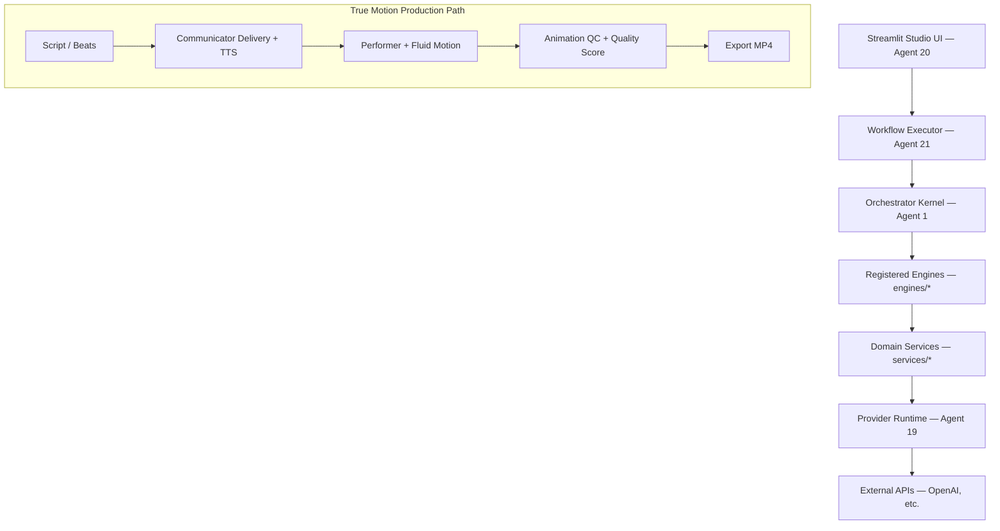

# System Audit — Generational AI Media Platform

**Audit date:** 2026-07-11  
**Branch:** `release/1.0.0-rc2` (pre-audit commit `142b22c`)  
**Agent 0 — Full-system review**

## Architecture (verified)

**Entry points:** `app.py` (Streamlit), `scripts/*` (benchmarks), Orchestrator via Workflow Executor.

**Data flow:** User objective → trend/research → psychology → script → visual → quality → production → packaging → AI director → creative → assets → animation → voice → render → post → SEO → publish → analytics → learning.

**Parallel live path:** Educator benchmarks bypass Ken Burns asset pipeline — `render_lip_sync_performance()` with choreographed stick-figure animation (Project Fluid Motion).

## Baseline metrics (pre-change → post-change)

| Metric | Before audit | After audit |
|--------|--------------|-------------|
| Tests passed | 881 | **890** (+9 new) |
| Tests failed | 10 | 10 (unchanged categories) |
| Test duration | ~183s | ~133–178s |
| Full benchmark render | N/A | **25.4s**, 14.4s render |
| Quality score (benchmark) | N/A | **75.1** overall, passed |
| Educational Director | N/A | **84.8**, passed |

## Major strengths

- Orchestrator + Workflow Executor provide durable runs, checkpoints, retries
- Provider Runtime is the sole AI gateway with content-address caching
- True-motion educator path produces verified MP4s with animation QC
- GCIS captures validation reports and lessons
- 40+ engines registered; core pipeline stages complete

## Major weaknesses

1. **Engine registry drift** — `animation` engine marked `ready=False` in registry but true-motion runs outside engine path; 4 render/workflow tests fail on readiness assumptions
2. **SEO circular import** — `services.seo.keywords` ↔ `engines.seo_optimization` (partially fixed via lazy imports in `package.py`)
3. **TTS path validation** — empty `path` from provider could resolve to `.` (fixed in `communicator_delivery.py`)
4. **Multi-account** — `ChannelManager` exists but no full Org→Brand→Platform hierarchy enforcement at publish time
5. **Publishing** — YouTube OAuth not configured; live publish blocked
6. **Asset pipeline QC** — slideshow rejection correctly enforced; offline tests required true_motion metadata
7. **Render engine tests** — fail when live image providers unavailable in sandbox

## Duplicate / overlapping systems

| Area | Overlap | Recommendation |
|------|---------|----------------|
| Animation | Ken Burns render vs performer lip-sync | Keep both; route by production type |
| Quality | `animation_qc`, performer QC, new `content_score` | Unify reporting via `QualityReport` |
| Caching | Provider cache, asset_generation fingerprint, new Repetition Booster | Booster tracks lineage; provider cache handles API |
| Agent contracts | WorkflowStep vs new AgentTask | AgentTask for delegation; WorkflowStep for runs |

## Technical debt (priority)

- P0: Fix remaining 10 test failures (engine readiness metadata, render sandbox)
- P1: Wire Educational Director + QualityReport into asset production export gate
- P1: Expand Repetition Booster into voice/script stage skips
- P2: Phoneme-driven lip sync upgrade path
- P3: Studio UI progress for new quality dimensions

## Scalability concerns

- Local JSON storage for channels/projects — needs DB + secrets manager at scale
- No queue worker separation — long renders block CLI sessions
- Media assets in `data/media/` grow unbounded — retention policy needed

## Security (verified)

- Credentials via env / provider_runtime secrets — not logged in reports
- Channel credentials stored in local JSON — documented risk, not production-ready
- No secrets in audit deliverables

## Recommended priorities

1. Fix engine readiness registry to match true-motion reality
2. YouTube OAuth for Track A live publish
3. Integrate quality + educational gates into default export path
4. Repetition Booster wired to TTS + script regeneration
5. Queue/worker split for unattended production
