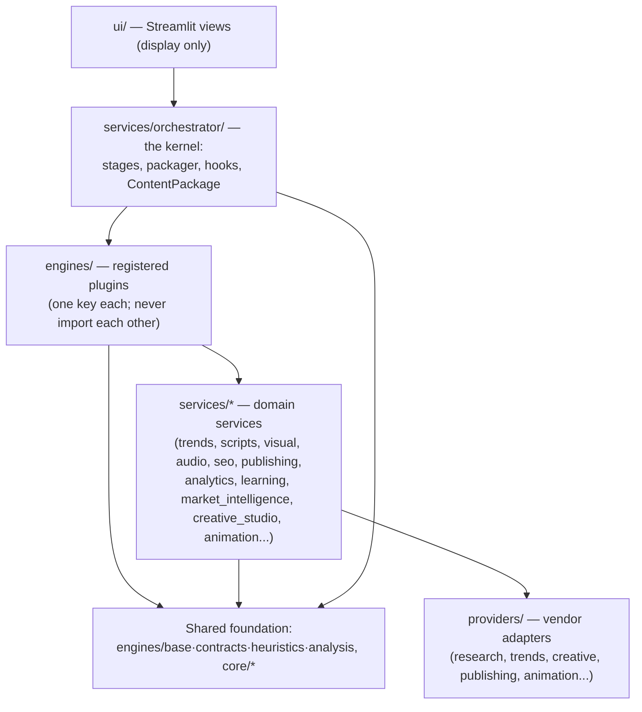

# Generational — System Dependency Map (v9.6)

Who may depend on whom, the full pipeline data flow, and the live engine
dependency graph. The machine-readable version of this document is
`engines.registry.dependency_graph()` and `engines.registry.capability_index()`;
`tests/test_architecture.py` keeps code and map consistent.

---

## 1. Layer diagram (allowed dependency directions)

Dependencies point downward only. A layer never imports anything above it.

- The **orchestrator** discovers engines through the registry only
  (`tests/test_architecture.py::test_orchestrator_does_not_import_engine_modules`).
- **Engines** never import engines (Architecture Directive #1, statically
  enforced). The two sanctioned exceptions are the `image`/`video` stage
  adapters fronting Agent 6's own `engines/render/` subsystem.
- **Providers** are imported by services/engines through interfaces only —
  vendor SDKs never appear above the provider layer.

## 2. Pipeline data flow (stage → stage via ContentPackage/context)

```mermaid
graph LR
    CMD([User Command]) --> T[trend<br/>discovery+ranking+<br/>forecasting+market intel]
    T --> R[research+ideation]
    R --> P[psychology]
    P --> S[script]
    S --> A[attention]
    A --> V[visual]
    V --> AU[audio]
    AU --> REF[refinement<br/>ranking·critic·revision·<br/>citation·seo·threats]
    REF --> Q[quality gate]
    Q --> PROD[media production]
    PROD -->     PKG[packaging →<br/>ContentPackage]
    PKG --> REN[render]
    REN --> SEO[seo optimization]
    SEO --> PUB[publish<br/>scheduler+publishing]
    PUB --> AN[analytics]
    AN --> L[learning]
    L --> BM[brand mgmt<br/>stub]
    L -.feedback loop.-> T
```

Every arrow is the orchestrator handing the shared context / ContentPackage
to the next stage — never a direct call.

## 3. Live engine dependency graph (declared contracts)

Generated from `registry.dependency_graph()` — contract engines declare the
engine keys that must run earlier. Verified against the registry by tests.

| Engine | Declares dependencies on |
|---|---|
| `trend_forecasting` | `trend_discovery`, `opportunity_ranking` |
| `market_intelligence` | `trend_discovery`, `opportunity_ranking`, `trend_forecasting` |
| `creative_studio` | `quality` |
| `render` / `image` / `video` | `visual_intelligence`, `voice_audio`, `quality` |
| `seo_optimization` | `seo`, `quality` |
| `scheduler` | `publishing_queue` |
| `publishing` | `render`, `seo_optimization` (via package inputs) |
| `analytics` | `publishing` |
| `learning` | `analytics` |
| `brand_management` (stub) | `learning` |

Classic (pre-contract) engines order themselves via `WORKFLOWS["intelligence"]`
— the single source of truth the orchestrator derives its plan from.

## 4. Module boundary rules (summary)

| Boundary | Rule | Enforced by |
|---|---|---|
| engine ↔ engine | never import; coordinate via orchestrator + package | static AST test |
| engine ↔ registry | register/replace only, never fetch-and-run | static test |
| orchestrator ↔ engines | registry discovery only, no engine imports | static test |
| package fields | additive-only, own-slot writes | `CONTENT_PACKAGE_FIELDS` + tests |
| stages/workflows ↔ registry | every referenced key must be registered | consistency test |
| declared dependencies | must reference registered engines | consistency test |
| vendors | behind `providers/` interfaces only | review (Directive #2 candidate) |
